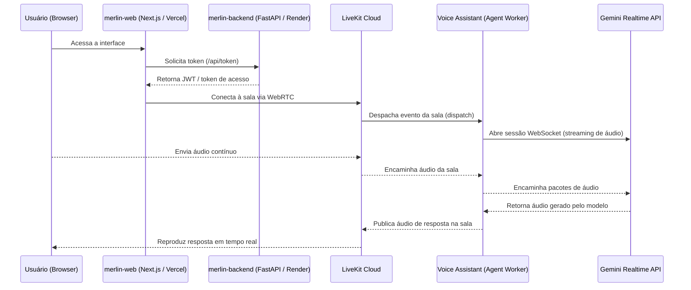

# 🧙‍♂️ Merlin Voice Agent

> Agente de voz conversacional em tempo real, multimodal e de ultrabaixa latência — construído com WebRTC e IA generativa nativa em áudio.

[](./LICENSE)
[](https://nextjs.org/)
[](https://fastapi.tiangolo.com/)
[](https://livekit.io/)
[](https://ai.google.dev/)

**🔗 Demo:** [merlin-voice-agent.vercel.app](https://merlin-voice-agent.vercel.app)

---

## 📖 Visão Geral

O **Merlin Voice Agent** é uma aplicação distribuída de ponta a ponta que permite conversação multimodal por voz em tempo real. A arquitetura conecta uma interface web moderna a um pipeline de IA generativa via **WebRTC**, processando fluxos contínuos de áudio bidirecional — sem depender de pipelines tradicionais e mais lentos de **STT → LLM → TTS**.

Em vez disso, o Merlin usa uma API com entrada e saída de áudio nativas, capturando entonação e intenção com resposta quase instantânea.

## 🏗️ Arquitetura

O projeto é um **monorepo** dividido em três camadas desacopladas:

```
merlin-project/
├── merlin-web/          # Interface do usuário (Frontend em Next.js)
├── merlin-backend/      # Servidor de autenticação e emissão de tokens (FastAPI)
└── Voice Assistant/     # Worker do agente em tempo real (LiveKit Agents + Gemini Live)
```



### Componentes e justificativas técnicas

| Camada | Tecnologia | Por quê |
|---|---|---|
| **Frontend** | Next.js (Vercel) | Renderização otimizada, ciclo de vida estruturado com React e suporte direto à biblioteca `@livekit/components-react`. Deploy na Vercel garante CI/CD via GitHub, variáveis de ambiente seguras e baixa latência de borda. |
| **Backend de autenticação** | FastAPI (Render) | Framework assíncrono de altíssima performance para emissão de JWTs e tokens temporários de acesso ao LiveKit. Render facilita o deploy de serviços Python desacoplados do frontend. |
| **Infraestrutura WebRTC** | LiveKit Cloud | Elimina a complexidade de manter servidores SFU próprios, garantindo roteamento estável de áudio/vídeo, baixa latência global e compatibilidade via WebSockets/WebRTC. |
| **Agente de IA** | LiveKit Agents SDK + Gemini Realtime API | O Gemini Realtime permite áudio nativo de entrada e saída (sem pipeline STT→LLM→TTS). O LiveKit Agents SDK orquestra sessões, detecção de atividade de voz (VAD), interrupções naturais de fala (*barge-in*) e o ciclo de vida das salas. |

## 🔄 Fluxo de dados

1. **Autenticação** — o cliente acessa a interface web e solicita um token seguro na rota `/api/token` do FastAPI hospedado no Render.
2. **Conexão WebRTC** — com o token gerado, a interface conecta-se à sala correspondente no cluster do LiveKit Cloud.
3. **Dispatch do worker** — o LiveKit Cloud despacha o evento da sala para o processo do agente (`agent.py`).
4. **Streaming multimodal** — o agente abre uma sessão contínua de WebSocket com a API do Gemini. O áudio do usuário é enviado em pacotes contínuos e o áudio gerado pelo modelo é transmitido diretamente de volta para a sala WebRTC.

## 🚀 Rodando localmente

### Pré-requisitos

- Node.js 18+ e npm/pnpm
- Python 3.10+
- Conta no [LiveKit Cloud](https://livekit.io/) (URL, API Key e API Secret)
- Chave de API do [Gemini](https://ai.google.dev/)

### 1. Clonar o repositório

```bash
git clone https://github.com/Guilherme-Lopesz/Merlin-voice-agent.git
cd Merlin-voice-agent
```

### 2. Backend de autenticação (`merlin-backend`)

```bash
cd merlin-backend
python -m venv venv && source venv/bin/activate  # Windows: venv\Scripts\activate
pip install -r requirements.txt
```

Crie um arquivo `.env` com:

```env
LIVEKIT_URL=wss://<seu-projeto>.livekit.cloud
LIVEKIT_API_KEY=<sua-api-key>
LIVEKIT_API_SECRET=<seu-api-secret>
```

```bash
uvicorn main:app --reload
```

### 3. Worker do agente (`Voice Assistant`)

```bash
cd "Voice Assistant"
python -m venv venv && source venv/bin/activate
pip install -r requirements.txt
```

Crie um arquivo `.env` com:

```env
LIVEKIT_URL=wss://<seu-projeto>.livekit.cloud
LIVEKIT_API_KEY=<sua-api-key>
LIVEKIT_API_SECRET=<seu-api-secret>
GEMINI_API_KEY=<sua-chave-gemini>
```

```bash
python agent.py dev
```

### 4. Frontend (`merlin-web`)

```bash
cd merlin-web
npm install
```

Crie um arquivo `.env.local` com:

```env
NEXT_PUBLIC_API_URL=http://localhost:8000
```

```bash
npm run dev
```

> ⚠️ Ajuste os nomes de variáveis acima conforme os arquivos `.env.example` reais de cada pasta do projeto.

## ⚠️ Limitações atuais

- **Cold start no Render (instâncias gratuitas):** no plano free, o backend entra em repouso após inatividade e pode levar até ~50 segundos para emitir o primeiro token em requisições a frio.
- **Quotas da API Gemini Realtime:** o fluxo contínuo de áudio consome cotas intensivas de RPD (requisições por dia) e RPM/TPM (por minuto).
- **Execução híbrida do agente:** atualmente o worker roda localmente, exigindo um ambiente de computação contínua (VPS, Render Worker, Fly.io etc.) para disponibilidade 24/7 sem depender de máquina local.

## 🗺️ Roadmap

- [ ] **Deploy contínuo do worker** — hospedar o agente LiveKit em servidor Linux dedicado (container Docker) para operação 100% autônoma na nuvem.
- [ ] **Suporte a visão computacional** — streaming de vídeo/câmera do cliente para o Merlin analisar o ambiente visual junto ao áudio.
- [ ] **Memória persistente e RAG** — integração com bancos de dados vetoriais para manter contexto entre conversas e acessar bases de conhecimento privadas.
- [ ] **Observabilidade** — métricas de latência (TTFB), custo de tokens e taxa de reconexão.

## 🤝 Contribuindo

Contribuições são bem-vindas! Sinta-se à vontade para abrir uma *issue* descrevendo o problema ou a melhoria antes de enviar um *pull request*.

1. Faça um fork do projeto
2. Crie uma branch (`git checkout -b feature/minha-feature`)
3. Commit suas mudanças (`git commit -m 'feat: minha feature'`)
4. Push para a branch (`git push origin feature/minha-feature`)
5. Abra um Pull Request

## 📄 Licença

Distribuído sob a licença MIT. Veja [`LICENSE`](./LICENSE) para mais detalhes.

## 👤 Autor

**Guilherme Lopes** — [@Guilherme-Lopesz](https://github.com/Guilherme-Lopesz)
